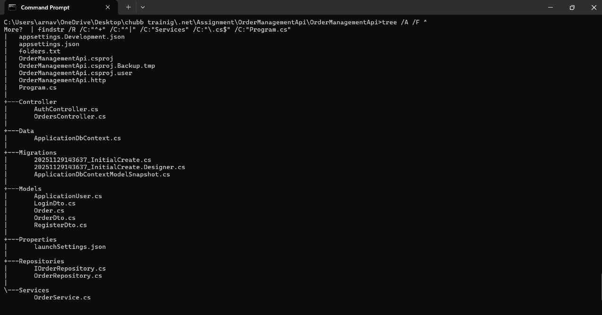
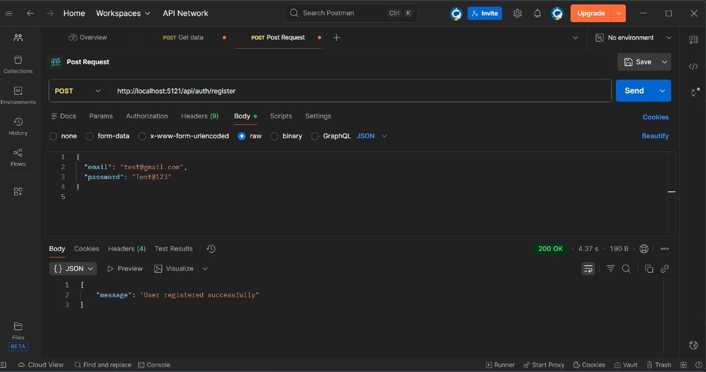
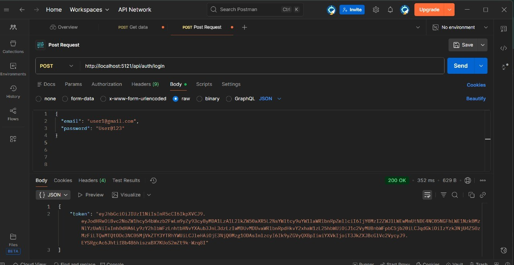
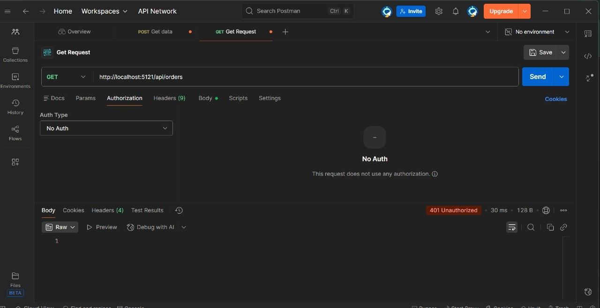
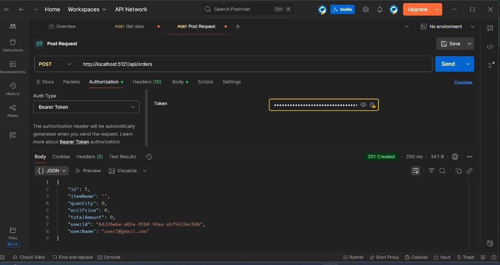
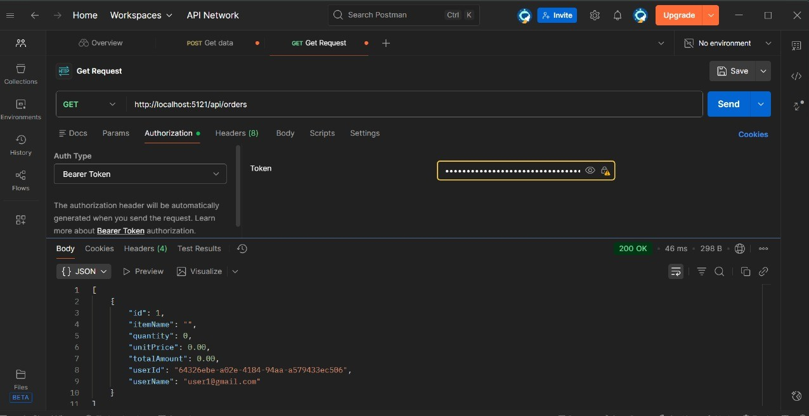
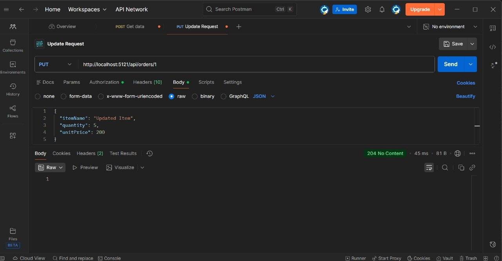
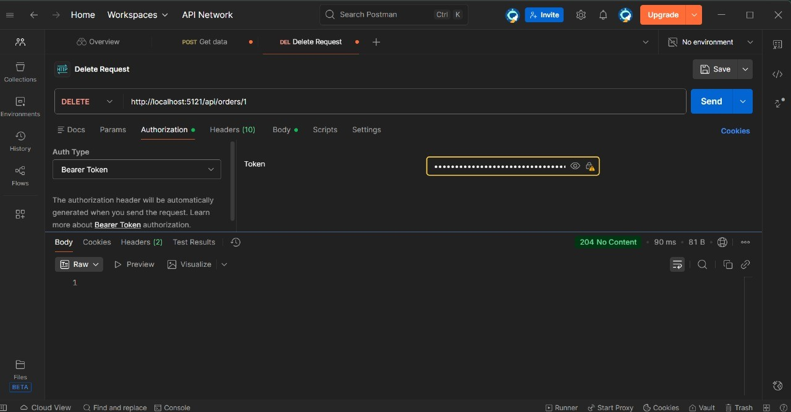

## 📸 **Screenshots**

### **1. Project Structure**

### **2. Fetching Token – Register User**

### **3. Login JWT – Login to Get Token**

### **4. Unauthorized Request (401)**

### **5. Authorized Create Order (POST)**

### **6. Authorized Get Orders (GET)**

### **7. Authorized Update Order (PUT)**

### **8. Authorized Delete Order (DELETE)**

